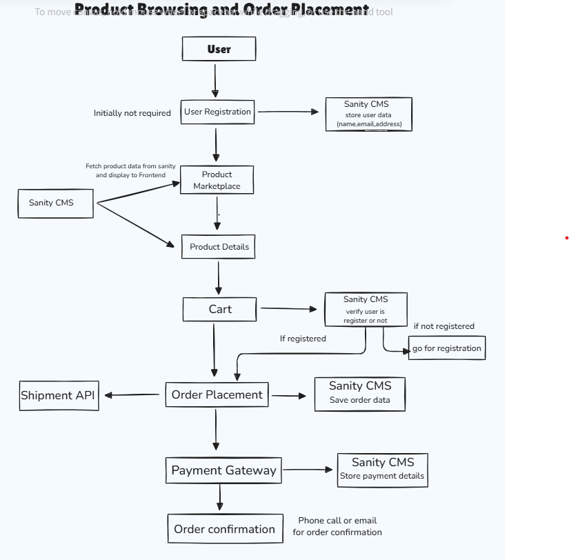

Here's the Markdown code for your documentation:


# Marketplace Technical Foundation - ZAAR

## 1. System Architecture Overview

### Components:
- **Frontend:**
  - Built using **Next.js**, **React.js**, **Tailwind CSS**, **TypeScript**, and **Shadcn-UI**.
  - Provides a seamless user interface for browsing products, managing carts, and completing orders.
- **Sanity CMS:**
  - Manages content and product data.
  - Handles dynamic updates for product inventory and details.
- **Shipping Integration:**
  - Integrated with **ShipEngine** for real-time shipment tracking and delivery management.

### Architecture Diagram:


---

## 2. Key Workflows

### Workflow 1: Product Browsing and Order Placement

1. **User Registration:**
   - Not initially required.
   - Sanity CMS stores user data (e.g., name, email, address).

2. **Product Marketplace:**
   - Fetch product data from Sanity CMS and display it on the frontend.

3. **Product Details:**
   - Users can view detailed product information.

4. **Cart Management:**
   - Users add products to their cart.
   - Sanity CMS verifies if the user is registered. If not, the user is prompted to register.

5. **Order Placement:**
   - Registered users proceed to place orders.
   - Sanity CMS saves order data and creates shipment details using the ShipEngine API.

6. **Payment Gateway:**
   - Users complete payment, and Sanity CMS stores payment details.

7. **Order Confirmation:**
   - Confirmation is sent via phone call or email.

### Product Browsing and Order Placement Workflow Diagram


---

## 3. Category-Specific Instructions

### General eCommerce:
- **Real-Time Inventory:** Sanity CMS ensures accurate stock updates.
- **Express Delivery:** Managed using the ShipEngine API.
- **Endpoints:**
  - `/products` for product listing.
  - `/create-order` for placing orders.

---

## 4. API Endpoints

| Endpoint          | Method | Purpose                                   | Response Example |
|-------------------|--------|-------------------------------------------|------------------|
| `/products`       | GET    | Fetch all product details                | See Below        |
| `/create-customer`| POST   | Send data of new registered customer      | See Below        |
| `/get-customer`   | GET    | Fetch data of all registered customers    | See Below        |
| `/create-order`   | POST   | Create a new order                       | See Below        |
| `/get-order`      | GET    | Fetch data of all orders                 | See Below        |

**Example Responses:**
1. **GET /products**:
```json
[
  {
    "_type": "product",
    "product_id": 1,
    "product_name": "Elegant Summer Dress",
    "price": 40
  }
]
```

2. **POST /create-customer**:
```json
{
  "_type": "customer",
  "customer_id": 1,
  "name": "Demo Name",
  "email": "demo@example.com"
}
```

---

## 5. Sanity Schemas

### Product Schema:
```javascript
export default {
  name: "product",
  type: "document",
  title: "Product",
  fields: [
    { name: "product_id", type: "number", title: "Product ID" },
    { name: "product_name", type: "string", title: "Product Name" },
    { name: "image", type: "image", title: "Image", options: { hotspot: true } },
    { name: "description", type: "text", title: "Description" },
    { name: "category", type: "string", title: "Category" },
    { name: "price", type: "number", title: "Price" },
    { name: "stock", type: "number", title: "Stock" },
    {
      name: "rating",
      type: "object",
      title: "Rating",
      fields: [
        { name: "review", type: "number", title: "Review" },
        { name: "count", type: "number", title: "Count" }
      ]
    },
    {
      name: "size_options",
      type: "array",
      title: "Size Options",
      of: [{ type: "string" }]
    },
    {
      name: "color_options",
      type: "array",
      title: "Color Options",
      of: [{ type: "string" }]
    },
    { name: "material", type: "string", title: "Material" }
  ]
};
```

### Shipment Schema:
```javascript
export default {
  name: "shipment",
  type: "document",
  title: "Shipment",
  fields: [
    { name: "order_id", type: "number", title: "Order ID" },
    { name: "customer_id", type: "number", title: "Customer ID" },
    { name: "status", type: "string", title: "Status" },
    { name: "delivery_zone", type: "string", title: "Delivery Zone" },
    { name: "expected_delivery_date", type: "date", title: "Expected Delivery Date" }
  ]
};
```

---


## 6.  High-Level Workflow Diagram

